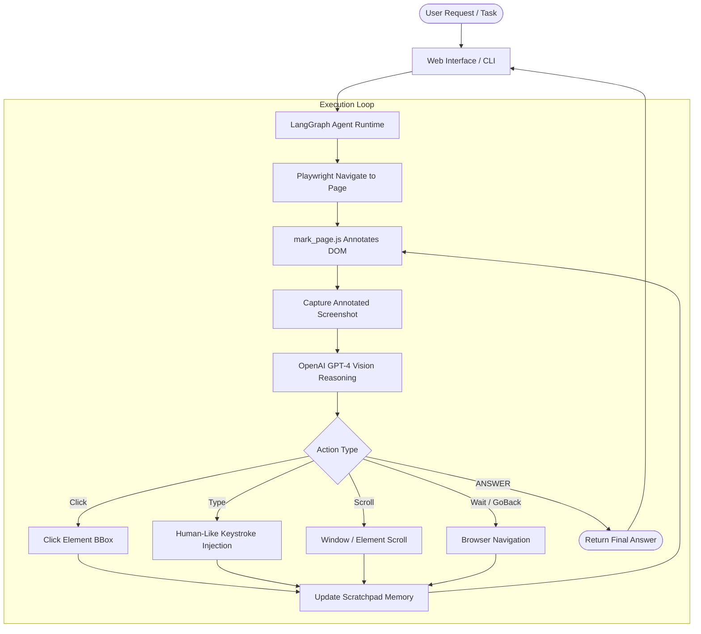

# 🌐 LangGraph Vision-Enabled Browser Agent

[](https://github.com/NETIZEN-11/LangGraph-Browser-Agent/actions)
[](https://www.python.org/downloads/)
[](https://github.com/langchain-ai/langgraph)
[](https://playwright.dev/)
[](LICENSE)
[](Dockerfile)

> **Autonomous multimodal AI agent** that browses the web like a human: analyzing visual screenshots, detecting interactive elements with numerical bounding boxes, and executing keyboard and mouse interactions using **LangGraph**, **OpenAI Vision**, and **Playwright**.

---

## 📑 Table of Contents

- [Key Highlights](#-key-highlights)
- [System Architecture](#-system-architecture)
- [Getting Started](#-getting-started)
  - [Prerequisites](#prerequisites)
  - [Installation](#installation)
- [Running the Application](#-running-the-application)
  - [1. Enterprise Web UI (Recommended)](#1-enterprise-web-ui-recommended)
  - [2. Interactive CLI](#2-interactive-cli)
  - [3. Docker Deployment](#3-docker-deployment)
  - [4. Alternative Web UI (FastAPI + Streamlit)](#4-alternative-web-ui-fastapi--streamlit)
- [Configuration](#-configuration)
- [Project Structure](#-project-structure)
- [Testing](#-testing)
- [CI/CD Workflow](#-cicd-workflow)
- [License](#-license)

---

## 🚀 Key Highlights

- **👁️ Multimodal Visual Grounding**: Injects lightweight JavaScript (`mark_page.js`) into live DOM sessions to calculate visual bounding boxes and overlay coordinate tags on actionable elements (buttons, inputs, links).
- **🧠 Cyclical State Flow via LangGraph**: Employs a stateful decision loop that reflects on previous observations, updates agent scratchpad memory, and iteratively navigates complex workflows.
- **🎨 Sleek Enterprise Dark Theme UI**: Custom-crafted interface running at `http://localhost:8080` with dark mode, live status telemetry, execution logs, and reactive responsive design.
- **🛡️ Built-in Resilience & Fallbacks**: Triple-layer prompt retrieval (LangChainHub -> LangSmith Client -> Self-contained offline template) ensuring reliable operation in any environment.
- **🤖 Human-Like Anti-Detection**: Simulates realistic typing delays (80ms - 150ms per key), natural mouse movement, element scrolling, and reading pauses.
- **🐳 Production Containerization**: Pre-configured multi-platform Docker container built on official Microsoft Playwright images.

---

## 🏛️ System Architecture



---

## ⚡ Getting Started

### Prerequisites

- **Python**: `3.12` or higher (Python 3.12 / 3.13 / 3.14 supported)
- **OpenAI API Key**: Access to multimodal models (`gpt-4-turbo`, `gpt-4o`)
- **Git** & **Pip**

### Installation

1. **Clone the repository:**
   ```bash
   git clone https://github.com/NETIZEN-11/LangGraph-Browser-Agent.git
   cd LangGraph-Browser-Agent
   ```

2. **Create and activate a virtual environment:**
   ```bash
   # Windows (PowerShell)
   python -m venv .venv
   .\.venv\Scripts\Activate.ps1

   # Linux / macOS
   python3 -m venv .venv
   source .venv/bin/activate
   ```

3. **Install dependencies:**
   ```bash
   pip install --upgrade pip
   pip install -r requirements.txt
   ```

4. **Install Playwright browsers:**
   ```bash
   playwright install chromium
   ```

5. **Set up your environment variables:**
   ```bash
   # Copy the example configuration
   cp .env.example .env
   ```
   Edit `.env` and set your OpenAI API key:
   ```ini
   OPENAI_API_KEY=sk-proj-your-openai-api-key-here
   OPENAI_MODEL=gpt-4-turbo
   BROWSER_HEADLESS=true
   PORT=8080
   ```

---

## 🖥️ Running the Application

### 1. Enterprise Web UI (Recommended)

Launch the primary Flask web interface:

```bash
python app.py
```

Open your browser and navigate to:
- **Web UI**: [http://localhost:8080](http://localhost:8080)
- **Health Check**: [http://localhost:8080/health](http://localhost:8080/health)
- **Configuration API**: [http://localhost:8080/config](http://localhost:8080/config)

Enter your task prompt (e.g., *"Search GitHub for top trending AI repositories and summarize the top 3"*) and click **Execute AI Agent**.

---

### 2. Interactive CLI

Execute browser tasks directly from your terminal:

```bash
python main.py
```

Follow the prompts to enter your task and watch the agent navigate and report its findings in real-time.

---

### 3. Docker Deployment

Run the complete containerized agent stack with zero local setup:

```bash
# Build and start with Docker Compose
docker compose up -d

# Or build single container
docker build -t langraph-browser-agent .
docker run -p 8080:8080 -e OPENAI_API_KEY=your-api-key langraph-browser-agent
```

Access the service at `http://localhost:8080`.

---

### 4. Alternative Web UI (FastAPI + Streamlit)

For dashboard-style execution:

```bash
# Start FastAPI backend
python web_ui/api.py

# In a separate terminal, launch Streamlit dashboard
streamlit run web_ui/streamlit_app.py
```

Dashboard available at `http://localhost:8501`.

---

## ⚙️ Configuration

Settings can be customized via `.env` or `config.yaml`:

| Variable | Default | Description |
| :--- | :--- | :--- |
| `OPENAI_API_KEY` | *None* | OpenAI API Key with Vision API access |
| `OPENAI_MODEL` | `gpt-4-turbo` | LLM model for visual reasoning (`gpt-4o`, `gpt-4-turbo`) |
| `HOST` | `0.0.0.0` | Bind address for Web Server |
| `PORT` | `8080` | Port for Enterprise Web Server |
| `BROWSER_HEADLESS` | `true` | Run browser in headless mode (`true` / `false`) |
| `DEFAULT_MAX_STEPS`| `50` | Default execution step limit per task |
| `MIN_MAX_STEPS` | `10` | Minimum allowed step threshold |
| `MAX_MAX_STEPS` | `150` | Maximum allowed step threshold |
| `LOG_LEVEL` | `INFO` | Logging level (`DEBUG`, `INFO`, `WARNING`, `ERROR`) |

---

## 📁 Project Structure

```text
LangGraph-Browser-Agent/
├── .github/
│   └── workflows/
│       └── ci.yml               # GitHub Actions CI/CD Pipeline
├── tests/
│   ├── conftest.py              # Pytest fixtures & async mocks
│   └── test_main.py             # 17 automated unit tests
├── web_ui/
│   ├── api.py                   # FastAPI service layer
│   └── streamlit_app.py         # Streamlit dashboard
├── app.py                       # Main Enterprise Flask Web App
├── config.py                    # Environment & runtime configuration
├── config.yaml                  # Agent operational settings
├── Dockerfile                   # Production Docker container (Playwright Noble)
├── docker-compose.yml           # Multi-service compose definition
├── main.py                      # Interactive CLI agent runner
├── mark_page.js                 # DOM element annotation & bounding box script
├── pyproject.toml               # Build system, Ruff, Black & Pytest config
├── requirements.txt             # Primary application dependencies
├── templates.py                 # Enterprise Dark Theme HTML/CSS template
└── README.md                    # Project documentation
```

---

## 🧪 Testing

The repository includes a comprehensive unit test suite with 100% mocked browser sessions to run offline:

```bash
# Run test suite
pytest tests/ -v

# Run with coverage report
pytest tests/ -v --cov=. --cov-report=term-missing
```

---

## 🔄 CI/CD Workflow

Every commit to `main` triggers automated GitHub Actions checks:
1. **System Dependencies Setup**: Installs headless graphics libraries on Ubuntu.
2. **Environment Validation**: Validates packages, dependency trees, and syntax (`py_compile`).
3. **Automated Unit Testing**: Runs full `pytest` suite across state transitions and parser functions.
4. **Docker Image Build**: Compiles Docker image using official Playwright base images to guarantee deployment readiness.

---

## 📄 License

Distributed under the **MIT License**. See [`LICENSE`](LICENSE) for complete details.

---

<p align="center">
  <b>Built with ❤️ by <a href="https://github.com/NETIZEN-11">NETIZEN-11</a></b>
</p>